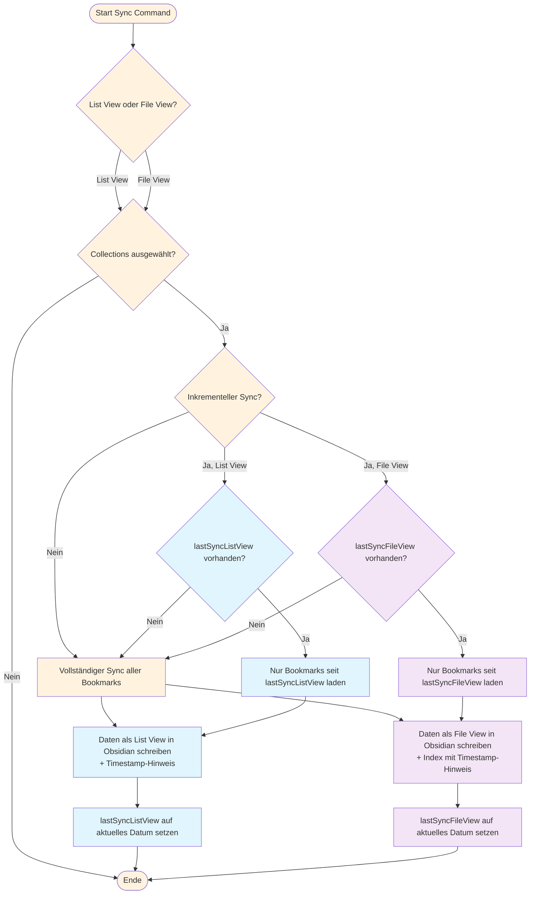

```mermaid
flowchart TD
    Start([Start Sync Command])
    CheckSyncType{List View oder File View?}
    CheckCollections{Collections ausgewählt?}
    CheckIncremental{Inkrementeller Sync?}
    CheckLastSyncList{lastSyncListView vorhanden?}
    CheckLastSyncFile{lastSyncFileView vorhanden?}
    FullSync["Vollständiger Sync aller Bookmarks"]
    IncrementalSyncList["Nur Bookmarks seit lastSyncListView laden"]
    IncrementalSyncFile["Nur Bookmarks seit lastSyncFileView laden"]
    WriteDataList["Daten als List View in Obsidian schreiben<br/>+ Timestamp-Hinweis"]
    WriteDataFile["Daten als File View in Obsidian schreiben<br/>+ Index mit Timestamp-Hinweis"]
    UpdateLastSyncList["lastSyncListView auf aktuelles Datum setzen"]
    UpdateLastSyncFile["lastSyncFileView auf aktuelles Datum setzen"]
    End([Ende])

    Start --> CheckSyncType
    CheckSyncType -- List View --> CheckCollections
    CheckSyncType -- File View --> CheckCollections
    CheckCollections -- Nein --> End
    CheckCollections -- Ja --> CheckIncremental
    CheckIncremental -- Nein --> FullSync
    
    CheckIncremental -- Ja, List View --> CheckLastSyncList
    CheckIncremental -- Ja, File View --> CheckLastSyncFile
    
    CheckLastSyncList -- Nein --> FullSync
    CheckLastSyncList -- Ja --> IncrementalSyncList
    CheckLastSyncFile -- Nein --> FullSync
    CheckLastSyncFile -- Ja --> IncrementalSyncFile
    
    FullSync --> WriteDataList
    FullSync --> WriteDataFile
    IncrementalSyncList --> WriteDataList
    IncrementalSyncFile --> WriteDataFile
    
    WriteDataList --> UpdateLastSyncList
    WriteDataFile --> UpdateLastSyncFile
    UpdateLastSyncList --> End
    UpdateLastSyncFile --> End

    %% Styling
    classDef listViewClass fill:#e1f5fe
    classDef fileViewClass fill:#f3e5f5
    classDef sharedClass fill:#fff3e0
    
    class CheckLastSyncList,IncrementalSyncList,WriteDataList,UpdateLastSyncList listViewClass
    class CheckLastSyncFile,IncrementalSyncFile,WriteDataFile,UpdateLastSyncFile fileViewClass
    class Start,CheckSyncType,CheckCollections,CheckIncremental,FullSync,End sharedClass
```

